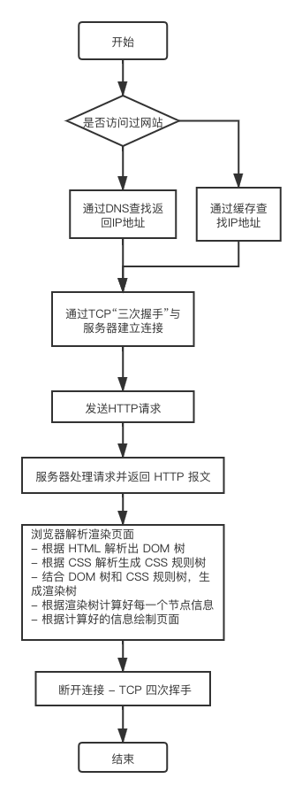

# 浏览器是如何渲染页面的

#### 1. DNS 解析 [将域名解析为 IP 地址]

**what？**

当用户输入一个网址并按下回车键的时候，浏览器得到了一个域名。而在实际通信过程中，我们需要的是一个 IP 地址。因此我们需要先把域名转换成相应的 IP 地址，这个过程称作 DNS 解析。

**how?**

1. 浏览器首先搜索浏览器自身缓存的 DNS 记录。

   > 浏览器自身也带有一层 DNS 缓存。Chrome 缓存 1000 条 DNS 解析结果，缓存时间大概在一分钟左右。
   >
   > （Chrome 浏览器通过输入：chrome://net-internals/#dns 打开 DNS 缓存页面）

2. 如果浏览器缓存中没有找到需要的记录或记录已经过期，则搜索 hosts 文件。（linux 系统的 hosts 文件在/etc/hosts 下。）

3. 如果在 hosts 文件中没有找到需要的记录或记录已经过期，则**向域名解析服务器发送解析请求**。

   > 浏览器通过 DNS 服务器发送域名，DNS 服务器查询到与域名相对应的 IP 地址，然后返回给浏览器，浏览器再将 IP 地址打在协议上，同时请求参数也会在协议搭载，然后一并发送给对应的服务器

4. 如果域名解析服务器也没有该域名的记录，则开始递归+迭代解析。

#### 2. TCP 连接 [TCP 三次握手]

三次握手的目的是为了防止已失效的连接请求报文段突然又传送到服务端，而产生错误

#### 3. 发送 HTTP 请求

其本质是在建立起的 TCP 连接中，按照 HTTP 协议标准发送一个索要网页的请求。

#### 4. 服务器处理请求并返回 HTTP 报文

#### 5. 浏览器解析渲染页面

- 根据 HTML 解析出 DOM 树

- 根据 CSS 解析生成 CSS 规则树

- 结合 DOM 树和 CSS 规则树，生成渲染树

- 根据渲染树计算好每一个节点信息

- 根据计算好的信息绘制页面

#### 6. 断开连接 - TCP 四次挥手

资料：https://developer.mozilla.org/zh-CN/docs/Web/Performance/How_browsers_work

